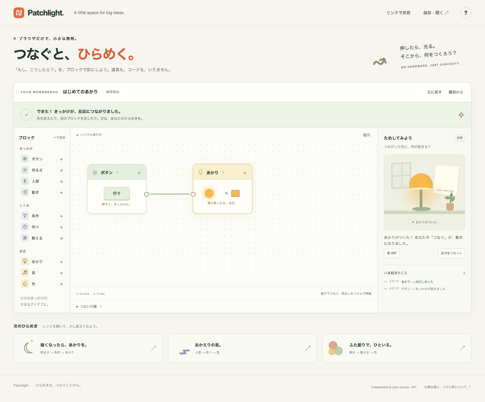

# Patchlight

**Connect a little. Make something happen.**

An independent, open-source playground for learning how to make things with connected blocks. Start with a button and a light; connect their ports, press the button, and see your idea work. No hardware, account, runtime dependencies, or build step.

日本語の画面で、**「ボタンの出力 → あかりの入力 → 押す」** の3操作から始めるブロック工房です。公開技術情報に基づく設計境界は [調査記録](docs/PUBLIC-SPEC.md)、実装・公開までの段階は [フェーズ計画](docs/ROADMAP.md) を参照してください。



## Try it in 30 seconds

Open `index.html` directly in a browser, or serve this directory:

```sh
npm start
# Open http://127.0.0.1:4173
```

`npm start` needs Node.js 22 or newer, **but no npm install**. Visitors to a hosted site need only a browser. Double-clicking `index.html` also works offline; clipboard/URL sharing uses HTTP(S), so use JSON export when opening local files.

1. Click the right-hand circle on **ボタン** (Button).
2. Click the left-hand circle on **あかり** (Light).
3. Click **押す** (Press). The block and the little room light up.

The steps are visible on screen. Input and output ports are real buttons with keyboard labels and 44px hit targets. There is no setup screen or separate Run button. The 30-second target is a product acceptance goal; automated coverage is recorded in [VALIDATION.md](docs/VALIDATION.md), separately from human usability testing.

## What you can make

| Blocks | Behavior in this playground |
| --- | --- |
| Button, motion, movement | Click/tap to create a simulated event. No real device or motion-sensor permission. |
| Brightness | Choose a number from 0–100. Release the slider to send it, or press “send this value.” This is an arbitrary teaching scale, not measured lux. |
| Condition | Pass numeric events strictly below/above a threshold. Booleans do not pass. |
| Wait | Forward each event after 0–10,000 ms. |
| Count | Forward every nth event, for n = 1–100. |
| Light | Turn on a virtual light in the chosen color; it stays on until reset/edit. |
| Sound | Play a short synthesized tone when audio is enabled; always show visible feedback. Audio starts OFF. |
| Color | Add a colored mark to a small canvas. Existing marks survive color changes and normal edits. |

Three original example recipes teach **conditions**, **delays**, and **counting**. None are imported official recipes. The color example is a small nod to [彩 / Irodori](https://hocky0301.github.io/irodori-mochi/), the workshop project that prompted this playground ([background article](https://zenn.dev/hocky3/articles/cb5c2024ba2776)).

Recipes are editable: add/remove blocks, move their headers, connect ports, change settings, remove individual links, arrange blocks, and undo up to 30 edits. Fan-out and fan-in are supported. All cycles are rejected, including those containing a Wait block.

**Editing wiring, positions, or logic/output settings resets pending timers and counters.** Changing the Brightness slider is a simulated input event and preserves running state. Recipe replacement and explicit output reset also clear the artwork. Outputs are aggregated in the preview; each Light block additionally shows its own state. The preview shows the latest light color, all retained paint marks (up to 36), and recent signal events.

### Save and share

- Recipes auto-save to local storage in this browser. A visible message reports unavailable storage.
- Export/import a versioned JSON file with **保存・開く**. Imports are validated before replacing your current graph.
- **リンクで共有** (mobile: **共有**) creates a URL containing the recipe in its fragment (`#recipe=…`). This sends no recipe to a server. A localhost link works only on the same computer; publish the static site before sharing a public link.
- Explicit recipe links seed a new session, then are consumed after successful local saving so later edits survive reload. A malformed recipe link is rejected; valid saved work is preserved. Ordinary page anchors are not recipe data.
- The recipe contains graph/settings, not runtime counters, audio preference, event history, or a finished painting.

### Keyboard and touch

Tab through controls. Enter/Space activate ports and triggers. Arrow keys move a focused block header. Escape cancels an unfinished connection. Connections can be removed using the expandable **つないだ線** list. On a phone, the workspace scrolls and the palette runs horizontally. Reduced-motion preferences disable decorative animation; signal changes remain visible.

## Scope: public concepts, independent behavior

Patchlight is inspired by the block-connection experience of Sony's MESH™. It is **an educational simulator with its own event model**, not a drop-in replacement for the official app, firmware, SDK runtime, or physical blocks.

The official BLE/GATT specifications, seven hardware families, and parts of the custom-block SDK are public. Those facts do not establish complete official-app or recipe-file compatibility. We document exactly what was confirmed in [PUBLIC-SPEC.md](docs/PUBLIC-SPEC.md), including source URLs, firmware limits, licenses, and the distinction between the SDK and MESH.js. The research date is 2026-09-15.

This version simulates concepts corresponding to Button, LED, Move, Motion, and Brightness. Temperature/Humidity and GPIO are documented in the research but **are not implemented**. Sensor calibration, gestures inferred from accelerometers, Bluetooth frames, official recipe imports, SDK scripts, cloud services, and firmware updates are outside this release. There is no Bluetooth code or permission prompt.

Web Bluetooth is an optional future adapter phase. See [ROADMAP.md](docs/ROADMAP.md) and [the architecture](docs/ARCHITECTURE.md) for its boundaries and hardware verification criteria.

## Develop and test

Runtime: plain HTML, CSS, and classic JavaScript. Tests: Node's built-in test runner and one pinned development dependency, Playwright. No CDN, web fonts, analytics, build tool, framework, or backend.

```sh
# Pure engine tests: no dependency installation needed
npm test

# Browser tests: development only
npm ci
npx playwright install chromium firefox webkit
npm run test:browser

# Both suites
npm run test:all
```

The browser suite runs Chromium, Firefox, WebKit, and a Chromium mobile viewport. These are automated browser-engine checks, not a claim that physical iPhone/iPad/Android or every browser version has been tested. Browser downloads are needed once for development; the application itself has no remote assets.

The simulation engine is `src/core.js` and can also be required from Node. See [ARCHITECTURE.md](docs/ARCHITECTURE.md) for its API, explicit execution rules, import schema, and guardrails. Graphs are limited to 32 nodes and 64 edges; imports are limited to 100 KiB. Unknown keys/types/versions, unsafe identifiers, invalid numbers, duplicates, and cycles are rejected. Nothing evaluates imported code.

```text
index.html              Accessible workshop UI
assets/icon.svg         Original project icon
src/app.js              Editor, simulation controls, audio, persistence
src/core.js             Pure validated graph/event engine
src/style.css           Responsive interface and original CSS scene
examples/               Original recipe JSON files
scripts/serve.cjs        Zero-dependency local static server
scripts/package.cjs     Build-free static-site packaging
tests/                  Engine and browser acceptance tests
docs/                   Research, architecture, phases, verification
.github/workflows/      Automated tests and manual Pages publication
```

## Publish without building

The project is ready to serve as static files, including under a subdirectory. No public deployment is implied by this repository.

For GitHub Pages:

1. Put this repository in your own GitHub repository.
2. In **Settings → Pages → Source**, choose **GitHub Actions**.
3. In **Actions → Publish static site**, run the workflow. It runs both test suites, copies the static assets, then deploys to Pages.

The publication workflow is **manual-only**. The ordinary CI workflow never deploys. See [GitHub's custom Pages workflow documentation](https://docs.github.com/en/pages/getting-started-with-github-pages/using-custom-workflows-with-github-pages) if repository permissions differ. Any other static host can serve the same files. `node scripts/package.cjs` copies the site into `site/`; this is packaging, not compilation. All JavaScript remains human-readable.

## Privacy

All simulation stays in the browser. There is no telemetry, authentication, external API, tracking cookie, camera/microphone permission, or device connection. Only recipe data is stored locally. The hosting provider may still log ordinary page requests; URL fragments are not included in HTTP requests. Export files and shared links contain whatever recipe title/settings you save.

## License and attribution

Original project code, interface, icon, CSS illustration, and example recipes: [MIT](LICENSE). See [THIRD_PARTY_NOTICES.md](THIRD_PARTY_NOTICES.md) for development dependencies and the distinct license of referenced technical documents.

Patchlight is an independent project and is not affiliated with, sponsored by, or endorsed by Sony Group Corporation or its affiliates. MESH is a trademark or registered trademark of Sony. The names appear only to identify the source of inspiration and the subject of the technical research. See [TRADEMARKS.md](docs/TRADEMARKS.md) for recommended public wording and future compatibility claims.

Contributions are welcome: read [CONTRIBUTING.md](CONTRIBUTING.md). Security-related reports: [SECURITY.md](SECURITY.md).
